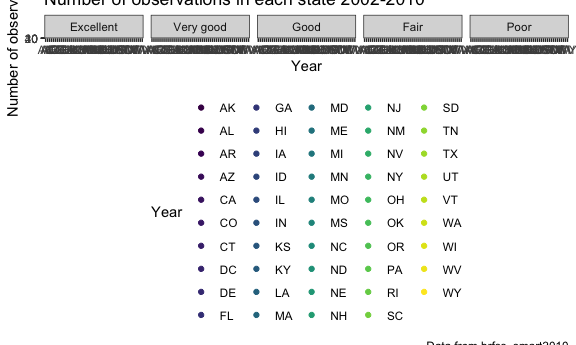

p8105\_hw3\_bs3142
================
Bingyu Sun
10/7/2018

Problem 1
---------

#### Section 1: Data import

``` r
library(p8105.datasets)
data(brfss_smart2010)
```

#### Section 2: Data Manipulation

Data Cleaning:

-   format the data to use appropriate variable names;
-   focus on the “Overall Health” topic
-   include only responses from “Excellent” to “Poor”
-   organize responses as a factor taking levels ordered from “Excellent” to “Poor”

``` r
brfss_data =
  brfss_smart2010 %>%
  janitor::clean_names() %>%
  filter(topic == "Overall Health") %>% # focus on "Overall Health" topic
  mutate(response = factor(response, levels = c("Excellent", "Very good", "Good", "Fair", "Poor"))) # convert responses to factor vector with specified orders

str(brfss_data)
```

    ## Classes 'tbl_df', 'tbl' and 'data.frame':    10625 obs. of  23 variables:
    ##  $ year                      : int  2010 2010 2010 2010 2010 2010 2010 2010 2010 2010 ...
    ##  $ locationabbr              : chr  "AL" "AL" "AL" "AL" ...
    ##  $ locationdesc              : chr  "AL - Jefferson County" "AL - Jefferson County" "AL - Jefferson County" "AL - Jefferson County" ...
    ##  $ class                     : chr  "Health Status" "Health Status" "Health Status" "Health Status" ...
    ##  $ topic                     : chr  "Overall Health" "Overall Health" "Overall Health" "Overall Health" ...
    ##  $ question                  : chr  "How is your general health?" "How is your general health?" "How is your general health?" "How is your general health?" ...
    ##  $ response                  : Factor w/ 5 levels "Excellent","Very good",..: 1 2 3 4 5 1 2 3 4 5 ...
    ##  $ sample_size               : int  94 148 208 107 45 91 177 224 120 66 ...
    ##  $ data_value                : num  18.9 30 33.1 12.5 5.5 15.6 31.3 31.2 15.5 6.4 ...
    ##  $ confidence_limit_low      : num  14.1 24.9 28.2 9.5 3.5 11 26 26.1 11.7 4.4 ...
    ##  $ confidence_limit_high     : num  23.6 35 38 15.4 7.4 20.1 36.5 36.2 19.2 8.3 ...
    ##  $ display_order             : int  1 2 3 4 5 1 2 3 4 5 ...
    ##  $ data_value_unit           : chr  "%" "%" "%" "%" ...
    ##  $ data_value_type           : chr  "Crude Prevalence" "Crude Prevalence" "Crude Prevalence" "Crude Prevalence" ...
    ##  $ data_value_footnote_symbol: chr  NA NA NA NA ...
    ##  $ data_value_footnote       : chr  NA NA NA NA ...
    ##  $ data_source               : chr  "BRFSS" "BRFSS" "BRFSS" "BRFSS" ...
    ##  $ class_id                  : chr  "CLASS08" "CLASS08" "CLASS08" "CLASS08" ...
    ##  $ topic_id                  : chr  "Topic41" "Topic41" "Topic41" "Topic41" ...
    ##  $ location_id               : chr  NA NA NA NA ...
    ##  $ question_id               : chr  "GENHLTH" "GENHLTH" "GENHLTH" "GENHLTH" ...
    ##  $ respid                    : chr  "RESP056" "RESP057" "RESP058" "RESP059" ...
    ##  $ geo_location              : chr  "(33.518601, -86.814688)" "(33.518601, -86.814688)" "(33.518601, -86.814688)" "(33.518601, -86.814688)" ...

#### Section 3: Q & A

**1. In 2002, which states were observed at 7 locations?**

``` r
brfss_data %>%
  filter(year == 2002) %>%
  group_by(locationabbr) %>%
  summarize(n_obs = n_distinct(locationdesc)) %>%
  filter(n_obs == 7)
```

    ## # A tibble: 3 x 2
    ##   locationabbr n_obs
    ##   <chr>        <int>
    ## 1 CT               7
    ## 2 FL               7
    ## 3 NC               7

**CT, FL, NC** were observed at 7 locations.

**2. Make a “spaghetti plot” that shows the number of locations in each state from 2002 to 2010.**

``` r
brfss_data %>%
  group_by(year, locationabbr) %>%
  summarize(n_obs = n_distinct(locationdesc)) %>%
  ggplot(aes(x = year, y = n_obs, color = locationabbr)) + 
    geom_line() +
    labs(
      title = "Number of observations in each state 2002-2010",
      x = "Year",
      y = "Number of observations",
      caption = "Data from brfss_smart2010"
  ) +
  viridis::scale_color_viridis(
    name = "State", 
    discrete = TRUE
  )
```


**3. Make a table showing, for the years 2002, 2006, and 2010, the mean and standard deviation of the proportion of “Excellent” responses across locations in NY State.**

``` r
brfss_data %>%
  filter(year %in% c("2002", "2006", "2010"), response == "Excellent", locationabbr == "NY") %>%
  spread(key = response, value = data_value) %>%
  group_by(year) %>%
  summarize(
    mean_prop_excellent_NY = mean(Excellent, na.rm = TRUE),
    sd_prop_excellent_NY = sd(Excellent, na.rm = TRUE)
  ) %>%
  knitr::kable(digits = 1)
```

|  year|  mean\_prop\_excellent\_NY|  sd\_prop\_excellent\_NY|
|-----:|--------------------------:|------------------------:|
|  2002|                       24.0|                      4.5|
|  2006|                       22.5|                      4.0|
|  2010|                       22.7|                      3.6|

**4. For each year and state, compute the average proportion in each response category (taking the average across locations in a state). Make a five-panel plot that shows, for each response category separately, the distribution of these state-level averages over time. **

``` r
brfss_data %>%
  filter(year == 2002) %>%
  group_by(locationabbr, response) %>%
  summarize(mean_prop_response = mean(data_value)) %>%
  ggplot(aes(x = locationabbr, y = mean_prop_response, color = locationabbr)) + 
    geom_point() +
    facet_grid(~response) +
    labs(
      title = "Number of observations in each state 2002-2010",
      x = "Year",
      y = "Number of observations",
      caption = "Data from brfss_smart2010"
  ) +
  viridis::scale_color_viridis(
    name = "Year", 
    discrete = TRUE
  )
```

    ## Warning: Removed 5 rows containing missing values (geom_point).

 ????????

Problem 2
---------

#### Section 1: Data import

``` r
data(instacart)
```

#### Section 2: Data exploration

**Summary**

#### Section 3: Q & A

**1. How many aisles are there, and which aisles are the most items ordered from?**

``` r
instacart %>%
  summarize(
    n_aisle = n_distinct(aisle),
    max_items = max(add_to_cart_order))
```

    ## # A tibble: 1 x 2
    ##   n_aisle max_items
    ##     <int>     <dbl>
    ## 1     134        80

There are **134** aisles. **nuts seeds dried fruit** and **packaged vegetables fruits** Which aisles are the most items ordered from?????

**2. Make a plot that shows the number of items ordered in each aisle. Order aisles sensibly, and organize your plot so others can read it.**

``` r
instacart %>%
  distinct(aisle, add_to_cart_order)
```

    ## # A tibble: 6,869 x 2
    ##    add_to_cart_order aisle                        
    ##                <int> <chr>                        
    ##  1                 1 yogurt                       
    ##  2                 2 other creams cheeses         
    ##  3                 3 fresh vegetables             
    ##  4                 4 fresh vegetables             
    ##  5                 5 canned meat seafood          
    ##  6                 6 fresh fruits                 
    ##  7                 7 fresh fruits                 
    ##  8                 8 packaged cheese              
    ##  9                 1 specialty cheeses            
    ## 10                 2 water seltzer sparkling water
    ## # ... with 6,859 more rows

?????????

**3. Make a table showing the most popular item aisles “baking ingredients”, “dog food care”, and “packaged vegetables fruits”.**

``` r
instacart %>%
  select(aisle, add_to_cart_order, product_name) %>%
  filter(aisle == c("baking ingredients", "dog food care", "packaged vegetables fruits")) %>%
  group_by(aisle, product_name) %>%
  summarize(most_popular_item = max(add_to_cart_order))
```

    ## # A tibble: 1,114 x 3
    ## # Groups:   aisle [?]
    ##    aisle           product_name                           most_popular_it…
    ##    <chr>           <chr>                                             <dbl>
    ##  1 baking ingredi… 1 to 1 Gluten Free Baking Flour                      29
    ##  2 baking ingredi… 1-to-1 Baking Flour, Gluten/Wheat/Dai…               22
    ##  3 baking ingredi… 100% Cacao Unsweetened Chocolate Baki…               15
    ##  4 baking ingredi… 100% Natural Sweetener Zero Calorie P…               33
    ##  5 baking ingredi… 100% Natural Zero Calorie Sweetener                   9
    ##  6 baking ingredi… 100% Organic Einkorn  All-Purpose Flo…               11
    ##  7 baking ingredi… 100% Organic Premium Whole Wheat Flour               20
    ##  8 baking ingredi… 100% Organic Unbleached All-Purpose F…               36
    ##  9 baking ingredi… 100% Organic Unbleached White Whole W…               21
    ## 10 baking ingredi… 100% Pure Corn Starch                                29
    ## # ... with 1,104 more rows

????????????

**4. Make a table showing the mean hour of the day at which Pink Lady Apples and Coffee Ice Cream are ordered on each day of the week; format this table for human readers (i.e. produce a 2 x 7 table).**

``` r
instacart %>%
  filter(product_name == c("Pink Lady Apples", "Coffee Ice Cream")) %>% 
  select(product_name, order_hour_of_day) %>%
  group_by(product_name) %>%
  summarize(mean_hour_of_day = mean(order_hour_of_day))
```

    ## Warning in product_name == c("Pink Lady Apples", "Coffee Ice Cream"):
    ## longer object length is not a multiple of shorter object length

    ## # A tibble: 2 x 2
    ##   product_name     mean_hour_of_day
    ##   <chr>                       <dbl>
    ## 1 Coffee Ice Cream             13.7
    ## 2 Pink Lady Apples             12.5

??? how to add week???
