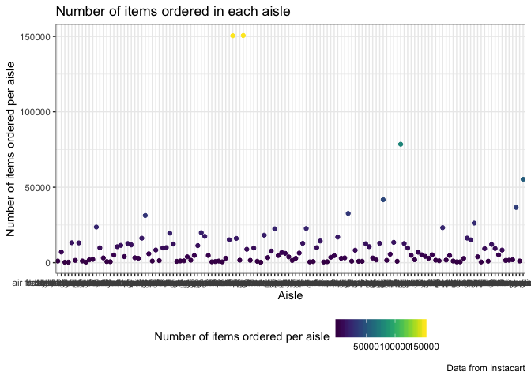
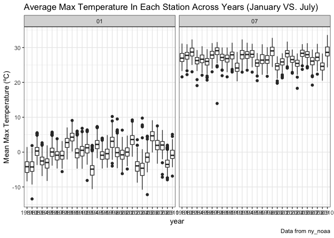

p8105\_hw3\_bs3142
================
Bingyu Sun
10/7/2018

Problem 1
---------

#### Section 1: Data import

``` r
library(p8105.datasets) #load library
data(brfss_smart2010) #import brfss data
```

#### Section 2: Data Manipulation

Data Cleaning:

-   format the data to use appropriate variable names;
-   focus on the “Overall Health” topic
-   include only responses from “Excellent” to “Poor”
-   organize responses as a factor taking levels ordered from “Excellent” to “Poor”

``` r
brfss_data =
  brfss_smart2010 %>%
  janitor::clean_names() %>% #clean names
  filter(topic == "Overall Health") %>% # focus on "Overall Health" topic
  mutate(response = factor(response, levels = c("Excellent", "Very good", "Good", "Fair", "Poor"))) # convert responses to factor vector with specified orders

str(brfss_data) #view variables
```

    ## Classes 'tbl_df', 'tbl' and 'data.frame':    10625 obs. of  23 variables:
    ##  $ year                      : int  2010 2010 2010 2010 2010 2010 2010 2010 2010 2010 ...
    ##  $ locationabbr              : chr  "AL" "AL" "AL" "AL" ...
    ##  $ locationdesc              : chr  "AL - Jefferson County" "AL - Jefferson County" "AL - Jefferson County" "AL - Jefferson County" ...
    ##  $ class                     : chr  "Health Status" "Health Status" "Health Status" "Health Status" ...
    ##  $ topic                     : chr  "Overall Health" "Overall Health" "Overall Health" "Overall Health" ...
    ##  $ question                  : chr  "How is your general health?" "How is your general health?" "How is your general health?" "How is your general health?" ...
    ##  $ response                  : Factor w/ 5 levels "Excellent","Very good",..: 1 2 3 4 5 1 2 3 4 5 ...
    ##  $ sample_size               : int  94 148 208 107 45 91 177 224 120 66 ...
    ##  $ data_value                : num  18.9 30 33.1 12.5 5.5 15.6 31.3 31.2 15.5 6.4 ...
    ##  $ confidence_limit_low      : num  14.1 24.9 28.2 9.5 3.5 11 26 26.1 11.7 4.4 ...
    ##  $ confidence_limit_high     : num  23.6 35 38 15.4 7.4 20.1 36.5 36.2 19.2 8.3 ...
    ##  $ display_order             : int  1 2 3 4 5 1 2 3 4 5 ...
    ##  $ data_value_unit           : chr  "%" "%" "%" "%" ...
    ##  $ data_value_type           : chr  "Crude Prevalence" "Crude Prevalence" "Crude Prevalence" "Crude Prevalence" ...
    ##  $ data_value_footnote_symbol: chr  NA NA NA NA ...
    ##  $ data_value_footnote       : chr  NA NA NA NA ...
    ##  $ data_source               : chr  "BRFSS" "BRFSS" "BRFSS" "BRFSS" ...
    ##  $ class_id                  : chr  "CLASS08" "CLASS08" "CLASS08" "CLASS08" ...
    ##  $ topic_id                  : chr  "Topic41" "Topic41" "Topic41" "Topic41" ...
    ##  $ location_id               : chr  NA NA NA NA ...
    ##  $ question_id               : chr  "GENHLTH" "GENHLTH" "GENHLTH" "GENHLTH" ...
    ##  $ respid                    : chr  "RESP056" "RESP057" "RESP058" "RESP059" ...
    ##  $ geo_location              : chr  "(33.518601, -86.814688)" "(33.518601, -86.814688)" "(33.518601, -86.814688)" "(33.518601, -86.814688)" ...

#### Section 3: Q & A

**1. In 2002, which states were observed at 7 locations?**

``` r
brfss_data %>%
  filter(year == 2002) %>% #retain data for 2002
  group_by(locationabbr) %>% #summarize based on locationabbr
  summarize(n_obs = n_distinct(locationdesc)) %>% #get total number of locations observed per state
  filter(n_obs == 7) #get states observed at 7 locations
```

    ## # A tibble: 3 x 2
    ##   locationabbr n_obs
    ##   <chr>        <int>
    ## 1 CT               7
    ## 2 FL               7
    ## 3 NC               7

**CT, FL, NC** were observed at 7 locations.

**2. Make a “spaghetti plot” that shows the number of locations in each state from 2002 to 2010.**

``` r
brfss_data %>%
  group_by(year, locationabbr) %>% #summarize by year and locationabbr
  summarize(n_obs = n_distinct(locationdesc)) %>% #count number of locations in each state
  ggplot(aes(x = year, y = n_obs, color = locationabbr)) + 
    geom_line() +
    labs(
      title = "Number of Locations in Each State 2002-2010",
      x = "Year",
      y = "Number of Observations",
      caption = "Data from brfss_smart2010"
  ) +
  viridis::scale_color_viridis(
    name = "State", 
    discrete = TRUE
  ) #make spagetti plot
```


**3. Make a table showing, for the years 2002, 2006, and 2010, the mean and standard deviation of the proportion of “Excellent” responses across locations in NY State.**

``` r
brfss_data %>%
  filter(year %in% c("2002", "2006", "2010"), response == "Excellent", locationabbr == "NY") %>% #get NY response for "Excellent" in 2002, 2006, and 2010
  spread(key = response, value = data_value) %>%
  group_by(year) %>% #summarize by years
  summarize(
    mean_prop_excellent_NY = mean(Excellent, na.rm = TRUE),
    sd_prop_excellent_NY = sd(Excellent, na.rm = TRUE)
  ) %>% #get mean and sd
  knitr::kable(digits = 1) #show mean and sd in table
```

|  year|  mean\_prop\_excellent\_NY|  sd\_prop\_excellent\_NY|
|-----:|--------------------------:|------------------------:|
|  2002|                       24.0|                      4.5|
|  2006|                       22.5|                      4.0|
|  2010|                       22.7|                      3.6|

**4. For each year and state, compute the average proportion in each response category (taking the average across locations in a state). Make a five-panel plot that shows, for each response category separately, the distribution of these state-level averages over time.**

``` r
brfss_data %>%
  group_by(year, locationabbr, response) %>%
  summarize(mean_prop_response = mean(data_value)) %>% #get average proportion in each response per state per year
  ggplot(aes(x = year, y = mean_prop_response, color = locationabbr)) + 
    geom_point() +
    facet_grid(~response) + #make panels by response
    labs(
      title = "Mean proportion by response in each state 2002-2010",
      x = "Year",
      y = "Mean proportion",
      caption = "Data from brfss_smart2010"
  ) +
  viridis::scale_color_viridis(
    name = "State", 
    discrete = TRUE
  ) #plot scatterplot showing mean proportion by response
```

    ## Warning: Removed 21 rows containing missing values (geom_point).


Problem 2
---------

#### Section 1: Data import

``` r
data(instacart) #load instacart data
```

#### Section 2: Data exploration

The goal is to do some exploration of this dataset. To that end, write a short description of the dataset, noting the size and structure of the data, describing some key variables, and giving illstrative examples of observations.

``` r
names(instacart)
```

    ##  [1] "order_id"               "product_id"            
    ##  [3] "add_to_cart_order"      "reordered"             
    ##  [5] "user_id"                "eval_set"              
    ##  [7] "order_number"           "order_dow"             
    ##  [9] "order_hour_of_day"      "days_since_prior_order"
    ## [11] "product_name"           "aisle_id"              
    ## [13] "department_id"          "aisle"                 
    ## [15] "department"

``` r
head(instacart)
```

    ## # A tibble: 6 x 15
    ##   order_id product_id add_to_cart_ord… reordered user_id eval_set
    ##      <int>      <int>            <int>     <int>   <int> <chr>   
    ## 1        1      49302                1         1  112108 train   
    ## 2        1      11109                2         1  112108 train   
    ## 3        1      10246                3         0  112108 train   
    ## 4        1      49683                4         0  112108 train   
    ## 5        1      43633                5         1  112108 train   
    ## 6        1      13176                6         0  112108 train   
    ## # ... with 9 more variables: order_number <int>, order_dow <int>,
    ## #   order_hour_of_day <int>, days_since_prior_order <int>,
    ## #   product_name <chr>, aisle_id <int>, department_id <int>, aisle <chr>,
    ## #   department <chr>

``` r
instacart %>%
  mutate(order_id = as.character(order_id),
         product_id = as.character(product_id),
         add_to_cart_order = as.integer(add_to_cart_order),
         reordered = as.integer(reordered),
         user_id = as.character(user_id),
         eval_set = as.character(eval_set),
         order_number = as.integer(order_number),
         order_dow = as.integer(order_dow),
         order_hour_of_day = as.integer(order_hour_of_day),
         days_since_prior_order = as.integer(days_since_prior_order),
         product_name = as.character(product_name),
         aisle_id = as.character(aisle_id),
         department_id = as.character(department_id),
         aisle = as.character(aisle),
         department = as.character(department)) %>%
  skimr::skim()
```

    ## Skim summary statistics
    ##  n obs: 1384617 
    ##  n variables: 15 
    ## 
    ## ── Variable type:character ─────────────────────────────────────────────────────────
    ##       variable missing complete       n min max empty n_unique
    ##          aisle       0  1384617 1384617   3  29     0      134
    ##       aisle_id       0  1384617 1384617   1   3     0      134
    ##     department       0  1384617 1384617   4  15     0       21
    ##  department_id       0  1384617 1384617   1   2     0       21
    ##       eval_set       0  1384617 1384617   5   5     0        1
    ##       order_id       0  1384617 1384617   1   7     0   131209
    ##     product_id       0  1384617 1384617   1   5     0    39123
    ##   product_name       0  1384617 1384617   3 159     0    39123
    ##        user_id       0  1384617 1384617   1   6     0   131209
    ## 
    ## ── Variable type:integer ───────────────────────────────────────────────────────────
    ##                variable missing complete       n  mean    sd p0 p25 p50
    ##       add_to_cart_order       0  1384617 1384617  8.76  7.42  1   3   7
    ##  days_since_prior_order       0  1384617 1384617 17.07 10.43  0   7  15
    ##               order_dow       0  1384617 1384617  2.7   2.17  0   1   3
    ##       order_hour_of_day       0  1384617 1384617 13.58  4.24  0  10  14
    ##            order_number       0  1384617 1384617 17.09 16.61  4   6  11
    ##               reordered       0  1384617 1384617  0.6   0.49  0   0   1
    ##  p75 p100     hist
    ##   12   80 ▇▃▁▁▁▁▁▁
    ##   30   30 ▂▅▃▃▁▂▁▇
    ##    5    6 ▇▅▃▃▁▃▅▅
    ##   17   23 ▁▁▃▇▇▇▅▂
    ##   21  100 ▇▂▁▁▁▁▁▁
    ##    1    1 ▆▁▁▁▁▁▁▇

**Summary**

-   The data consists of **15** variables with **1384617** rows.
-   There is **no** missing value in the dataset.
-   The data contains **21** departments and **134** aisles, with a total number of **39123** different products. There are **131209** customers ordered from instacart.
-   Each user is identified by a unique user id. Items added to cart by users are ordered chronologically, with corresponding product name, aisle, and their belonging department. Information for days since last order by each customers, the day of the week, and the hour of the day on which order was placed are recorded.
-   For example, customer with id "1" ordered 8 items such as yogurt, cheese, banana at 10am on Thursday.

#### Section 3: Q & A

**1. How many aisles are there, and which aisles are the most items ordered from?**

``` r
instacart %>%
  summarize(
    n_aisle = n_distinct(aisle_id),
    max_items = max(add_to_cart_order))
```

    ## # A tibble: 1 x 2
    ##   n_aisle max_items
    ##     <int>     <dbl>
    ## 1     134        80

``` r
instacart %>%
  select(aisle, add_to_cart_order) %>%
  filter(add_to_cart_order == 80)
```

    ## # A tibble: 2 x 2
    ##   aisle                      add_to_cart_order
    ##   <chr>                                  <int>
    ## 1 nuts seeds dried fruit                    80
    ## 2 packaged vegetables fruits                80

There are **134** aisles. The items **nuts seeds dried fruit** and **packaged vegetables fruits** are ordered the most.

**2. Make a plot that shows the number of items ordered in each aisle. Order aisles sensibly, and organize your plot so others can read it.**

``` r
instacart %>%
  group_by(department, aisle) %>%
  count(aisle) %>%
  ggplot(aes(x = aisle, y = n, color = department)) + 
    geom_point() +
    labs(
      title = "Number of items ordered in each aisle",
      x = "Aisle",
      y = "Number of items ordered",
      caption = "Data from instacart"
  ) +
  viridis::scale_color_viridis(
    name = "Aisle", 
    discrete = TRUE
  )
```

 ?????????

**3. Make a table showing the most popular item in each of the aisles “baking ingredients”, “dog food care”, and “packaged vegetables fruits”.**

``` r
instacart %>%
  filter(aisle %in% c("baking ingredients", "dog food care", "packaged vegetables fruits")) %>% 
  group_by(aisle) %>%
  count(product_name) %>%
  filter(min_rank(desc(n)) < 2) %>% #get the most popular item in each of the aisles
  knitr::kable(digits = 1)
```

| aisle                      | product\_name                                 |     n|
|:---------------------------|:----------------------------------------------|-----:|
| baking ingredients         | Light Brown Sugar                             |   499|
| dog food care              | Snack Sticks Chicken & Rice Recipe Dog Treats |    30|
| packaged vegetables fruits | Organic Baby Spinach                          |  9784|

**4. Make a table showing the mean hour of the day at which Pink Lady Apples and Coffee Ice Cream are ordered on each day of the week; format this table for human readers (i.e. produce a 2 x 7 table).**

``` r
instacart %>%
  filter(product_name %in% c("Pink Lady Apples", "Coffee Ice Cream")) %>%
  select(product_name, order_hour_of_day, order_dow) %>% 
  group_by(product_name, order_dow) %>%
  summarize(mean_order_hour_of_day = mean(order_hour_of_day)) %>%
  mutate(order_dow = c(1, 2, 3, 4, 5, 6, 7),
         order_dow = lubridate::wday(order_dow, label = TRUE),
         mean_order_hour_of_day = paste(floor(mean_order_hour_of_day),
                                        round((mean_order_hour_of_day - floor(mean_order_hour_of_day)) * 60),
                                               sep = ":")) %>% #convert number to week days, and decimal to minute
  spread(key = order_dow, value = mean_order_hour_of_day) %>%
  knitr::kable(digits = 1)
```

| product\_name    | Sun   | Mon   | Tue   | Wed   | Thu   | Fri   | Sat   |
|:-----------------|:------|:------|:------|:------|:------|:------|:------|
| Coffee Ice Cream | 13:46 | 14:19 | 15:23 | 15:19 | 15:13 | 12:16 | 13:50 |
| Pink Lady Apples | 13:26 | 11:22 | 11:42 | 14:15 | 11:33 | 12:47 | 11:56 |

Problem 3
---------

#### Section 1: Data import

``` r
data(ny_noaa)
```

#### Section 2: Data exploration

The goal is to do some exploration of this dataset. To that end, write a short description of the dataset, noting the size and structure of the data, describing some key variables, and indicating the extent to which missing data is an issue.

#### Section 3: Q & A

**1. Do some data cleaning. Create separate variables for year, month, and day. Ensure observations for temperature, precipitation, and snowfall are given in reasonable units. For snowfall, what are the most commonly observed values? Why?**

``` r
tidy_noaa = 
  ny_noaa %>%
  separate(date, into = c("year", "month", "day"), sep = "-") %>% #add year, month, and day
  mutate(prcp = prcp/10, 
         tmax = as.numeric(tmax)/10,
         tmin = as.numeric(tmin)/10) #convert values of prcp to mm and temp to ºC

tidy_noaa %>%
  filter(!is.na(snow)) %>%
  count(snow) %>%
  filter(min_rank(desc(n)) < 4) #get some of the commonly observed values
```

    ## # A tibble: 3 x 2
    ##    snow       n
    ##   <int>   <int>
    ## 1     0 2008508
    ## 2    13   23095
    ## 3    25   31022

For snowfall, the most commonly observed value was **0mm**, meaning snow days were less frequent compared to non-snow days. For days that did snow, the most commonly observed value was **25mm**, followed by 13mm as the second most frequent value.

**2. Make a two-panel plot showing the average max temperature in January and in July in each station across years. Is there any observable / interpretable structure? Any outliers?**

``` r
tidy_noaa %>%
  select(-(day:snwd), -tmin) %>%
  filter(month %in% c("01", "07") & !is.na(tmax)) %>% #get Jan and July data, and remove any missing value for tmax
  group_by(year, month, id) %>%
  summarize(mean_tmax = mean(tmax)) %>%
  ggplot(aes(x = year, y = mean_tmax, group = year)) + 
    geom_boxplot() +
    facet_grid(~month) + #create two-panel plots
    labs(
      title = "Average Max Temperature In Each Station Across Years (January VS. July)",
      x = "year",
      y = "Mean Max Temperature (ºC)",
      caption = "Data from ny_noaa"
  ) +
  viridis::scale_color_viridis(
    discrete = TRUE
  )
```



**3. Make a two-panel plot showing (i) tmax vs tmin for the full dataset (note that a scatterplot may not be the best option); and (ii) make a plot showing the distribution of snowfall values greater than 0 and less than 100 separately by year.**

``` r
plot_tmax_tmin = 
  tidy_noaa %>%
  count(tmin)
```
